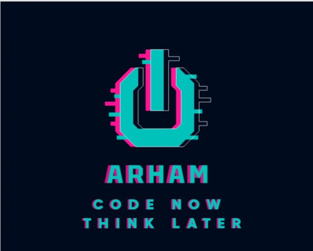

# 🎮 JavaScript Games Collection

<div align="center">
  
  
  [](https://opensource.org/licenses/MIT)
  
  [](https://github.com/yourusername/JavaScript-Games/pulls)
  
  A collection of 30+ classic and modern games built with vanilla JavaScript, HTML5, and CSS3.
</div>

## 🚧 Important Notice

This project is currently **under active development**. The code and features are subject to change. Please check back later for the stable release.

## 🔒 License and Usage

This project is **not open for direct copying or reuse**. The code is provided for educational and demonstration purposes only. All rights are reserved.

## 🎯 Features

- 30+ unique games built with vanilla JavaScript
- Responsive design that works on desktop and mobile devices
- No external dependencies - pure HTML5, CSS3, and JavaScript
- Clean and well-commented code for educational purposes
- Progressive Web App (PWA) support (coming soon)

## 🎮 Available Games

1. 🍭 Candy Crush
2. 🏹 Archery Game
3. ⌨️ Speed Typing Game
4. 🎱 Breakout Game
5. 💣 Minesweeper
6. 🏗️ Tower Blocks
7. 🏓 Ping Pong
8. 🧩 Tetris
9. 🌀 Tilting Maze
10. 🃏 Memory Card Game
11. ✂️ Rock Paper Scissors
12. 🔢 Number Guessing Game
13. ❌ Tic Tac Toe
14. 🐍 Snake Game
15. 🔴 Connect Four
16. 🐜 Insect Catcher
17. ⌨️ Typing Game
18. 💀 Hangman
19. 🐦 Flappy Bird
20. 🚶 Crossy Road
21. 🔢 2048
22. 🎲 Dice Roll Simulator
23. 🔵 Shape Clicker
24. ⌨️ Typing Master
25. 🔊 Speak & Guess
26. 🍉 Fruit Slicer
27. ❓ Quiz Game
28. 😀 Emoji Catcher
29. 🕳️ Whack A Mole
30. 🎮 Simon Says

## 🛠️ Technologies Used

- HTML5
- CSS3
- JavaScript (ES6+)
- Canvas API (for some games)
- Local Storage (for saving game progress)

## 🚀 Getting Started

1. Clone the repository:
   ```bash
   git clone https://github.com/Arham43-ops/JavaScript-Games.git
   ```
2. Navigate to any game directory
3. Open `index.html` in your web browser

## 📱 Browser Support

- Chrome (latest)
- Firefox (latest)
- Safari (latest)
- Edge (latest)
- Mobile Safari (iOS 10+)
- Chrome for Android (latest)

## 🤝 Contributing

While this project is not open for direct contributions at this time, we welcome:
- Bug reports
- Feature suggestions
- General feedback

Please open an issue to discuss any changes you'd like to make.

## 📝 License

This project is licensed under the MIT License - see the [LICENSE](LICENSE) file for details.

## 🙏 Acknowledgments

- Inspired by classic arcade and mobile games
- Built with ❤️ for educational purposes
- Special thanks to all the open-source projects that made this possible

## 📬 Contact

For any inquiries, please reach out to [topiwalaarham@gmail.com](mailto:topiwalaarham@gmail.com)

---

<div align="center">
  Made with ❤️ by Your Name | © 2025 All Rights Reserved
</div>
